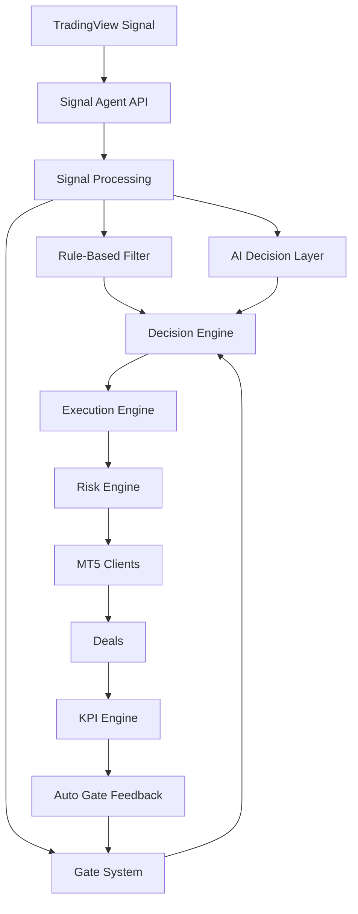

# 👋 Claus Nordhausen

### Backend Developer | API Architecture | Automation Systems | AI Decision Systems

---

## 🚀 What I Build

I design and build **production-grade backend systems** that:

* process signals
* make structured decisions
* integrate AI reasoning
* control risk
* operate across multiple clients

👉 Focus: **Automation Systems + Decision Engines + AI-Augmented Architectures**

---

## ⚙️ Tech Stack

---

## 🧠 System Architecture Mindset

I build systems with:

* deterministic core logic (no uncontrolled behavior)
* AI as an **augmentation layer**, not a replacement
* strict separation (signal / decision / execution / risk / tracking)
* full traceability (signals → decisions → trades → KPIs)
* real-time control over risk
* scalable multi-account architecture

---

## 🔥 Flagship System

### 🧠 Signal Agent API

A **controlled decision & execution backend** for automated trading systems
with optional **AI-powered decision support**.

---

## 🏗️ Architecture Overview

---

## ⚙️ Core Modules

### Signal Engine

* API ingestion
* normalization (BUY / SELL logic)
* payload validation

---

### Rule-Based Filtering

* deterministic validation
* structured approval logic
* gate-based execution control

---

### 🧠 AI Decision Layer

* optional OpenAI integration
* signal interpretation & enrichment
* confidence scoring
* contextual reasoning (non-blocking or advisory)

⚠️ AI is **controlled and sandboxed**
→ never directly executes trades

---

### Decision Engine

* merges:

  * rule-based logic
  * AI insights
  * gate status

* produces **final executable decision**

---

### Execution Engine

* controlled trade approval
* risk-aware execution
* deterministic behavior

---

### Risk Engine

* daily loss cap
* R-multiple tracking
* max trades per day
* capital protection rules

---

### KPI Engine

* drawdown calculation
* winrate tracking
* loss streak detection

---

### Auto Gate System

Dynamic protection layer:

* reduces or blocks trading based on:

  * drawdown
  * performance
  * system state

---

## 📊 What Makes This System Different

This is not a bot.

It is a **controlled AI-augmented decision system**:

* Every signal is validated
* Every decision is explainable
* AI is used **within strict boundaries**
* Risk is enforced at every step

👉 No uncontrolled automation
👉 No black-box execution

---

## 📈 Business Perspective

The system is designed for:

* multi-account trading infrastructures
* institutional-style risk control
* scalable automation systems
* AI-supported decision pipelines

---

## 🔗 Projects

### Signal Agent API

https://github.com/clausnordhausen-stack/signal-agent-api

### Trading Dashboard API

https://github.com/clausnordhausen-stack/trading-dashboard-api

### Trading Systems Dashboard (Flutter)

Frontend for monitoring & control

---

## 🎯 Current Focus

* AI-driven decision systems (controlled, not autonomous)
* hybrid architectures (rules + AI)
* scalable backend infrastructures
* real-time risk governance

---

## 📫 Contact

📧 [claus@nordhausen.me](mailto:claus@nordhausen.me)
🔗 https://github.com/clausnordhausen-stack

---

## 🧩 Positioning

I don’t build trading bots.

I build **controlled decision systems**
where automation, risk and AI work together — not against each other.

---

## License

Private / Proprietary
