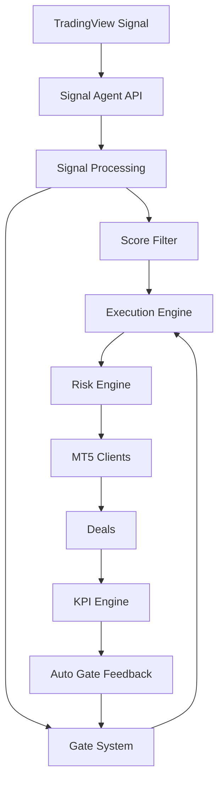

# 👋 Claus Nordhausen

### Backend Developer | API Architecture | Automation Systems

---

## 🚀 What I Build

I design and build **production-grade backend systems** that:

- process signals  
- make decisions  
- control risk  
- operate across multiple clients  

👉 Focus: **Automation Systems + Decision Engines + Scalable Architectures**

---

## ⚙️ Tech Stack

---

## 🧠 System Architecture Mindset

I build systems with:

- deterministic logic (no black box behavior)  
- clear separation (signal / execution / risk / tracking)  
- full traceability (signals → trades → KPIs)  
- real-time control over risk  
- scalability across accounts and strategies  

---

## 🔥 Flagship System

### 🧠 Signal Agent API

A **complete decision & execution backend** for automated trading systems.

---

## 🏗️ Architecture Overview

---

## ⚙️ Core Modules

### Signal Engine
- API ingestion
- normalization (BUY/SELL logic)
- payload handling

### Filtering Layer
- score-based validation  
- gate-based approval (GREEN / YELLOW / RED)

### Execution Engine
- dynamic risk scaling  
- priority logic  
- trade approval layer  

### Risk Engine
- daily loss cap  
- R-multiple tracking  
- max trades per day  

### KPI Engine
- drawdown calculation  
- winrate tracking  
- loss streak detection  

### Auto Gate System
- blocks or reduces risk based on:
  - drawdown  
  - winrate  
  - loss streak  

---

## 📊 What Makes This System Different

This is not a simple bot.

It is a **controlled decision system**:

- Every signal is evaluated  
- Every trade is tracked  
- Every risk is calculated  
- Every decision is explainable  

👉 **No uncontrolled execution**

---

## 📈 Business Perspective

The system is designed for:

- multi-account deployment  
- risk-controlled scaling  
- automated trading operations  
- future AI-agent integration  

---

## 🔗 Projects

### Signal Agent API
https://github.com/clausnordhausen-stack/signal-agent-api

### Trading Dashboard API
https://github.com/clausnordhausen-stack/trading-dashboard-api

### Trading Systems Dashboard (Flutter)
Frontend for monitoring & control

---

## 🎯 Current Focus

- AI-driven decision systems  
- advanced automation architectures  
- scalable backend infrastructure  

---

## 📫 Contact

📧 claus@nordhausen.me  
🔗 https://github.com/clausnordhausen-stack
